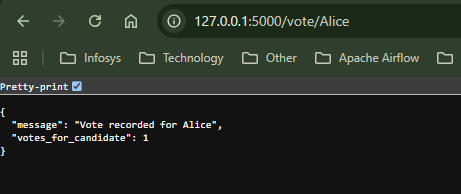
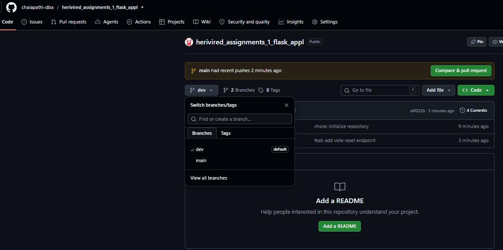
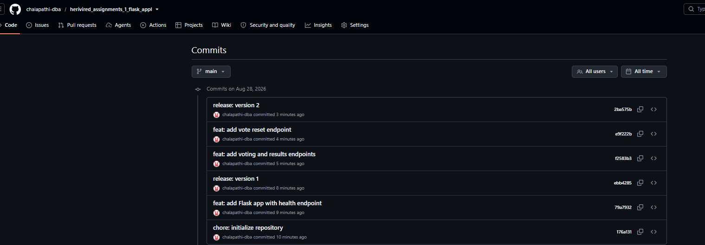

# Flask Voting Application

This application lets users vote for any candidate through a web address.  
The current vote totals can be viewed at any time.  
All votes are stored while the application is running.  
The application also provides an option to reset all vote counts.

## Installation and Setup

1. Clone the repository:

   ```powershell
   git clone  https://github.com/chalapathi-dba/herivired_assignments_1_flask_appl.git
   
   ```

2. Open the project folder:

   ```powershell
   cd YOUR-REPOSITORY
   ```

3. Create and activate a virtual environment:

   ```powershell
   py -m venv .venv
   .\.venv\Scripts\Activate.ps1
   ```

4. Install Flask:

   ```powershell
   py -m pip install Flask
   ```

5. Run the application:

   ```powershell
   py app.py
   ```

## API Endpoint Reference

| Endpoint | Method | Description | Example response |
|---|---|---|---|
| `/` | GET | Displays a welcome message. | `Welcome to the App` |
| `/health` | GET | Confirms that the app is running. | `App is running` |
| `/vote/<name>` | GET | Records a vote for the specified candidate. | `{"message":"Vote recorded for Alice","votes_for_candidate":1}` |
| `/results` | GET | Shows vote totals for every candidate. | `{"Alice": 2, "Bob": 1}` |
| `/reset` | GET | Clears all stored vote totals. | `{"message":"All vote counts have been reset"}` |

## Git Workflow

I used the `dev` branch for every code and documentation change. After testing each feature, I merged `dev` into `main`. The `main` branch therefore contains stable releases.

```text
dev → development and testing
dev → merge into main → stable release
```

## Version History

| Version | Changes |
|---|---|
| Version 1 | Added the basic Flask application with `/` and `/health`. |
| Version 2 | Added voting, results, and reset endpoints. |

## Screenshots

### Application Running



### GitHub Branches



### GitHub Commit History

